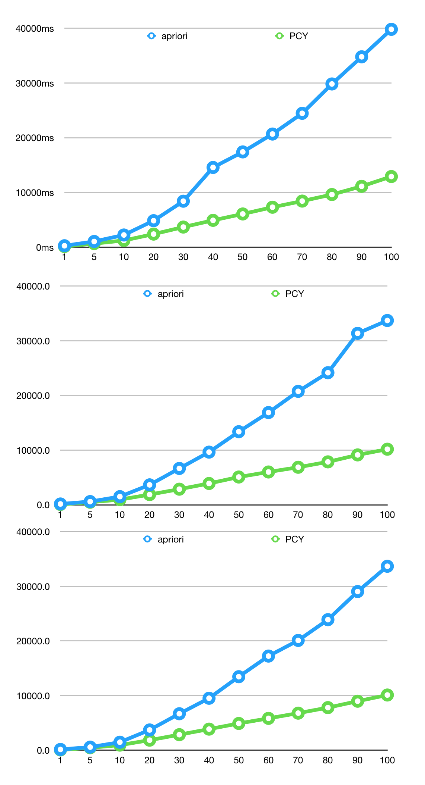

# Mining Frequent Itemsets

## Problem 

The main objective of this project is to find frequent itemsets by implementing two efficient algorithms: A-Priori and PCY. The goal is to find frequent pairs of elements.

Perform the scalability study for finding frequent pairs of elements by dividing the dataset into different chunks and measure the time performance. Provide the line chart. Provide results for the following support thresholds: 1%, 5%, 10%. For example, if your chunk is 10% of the dataset, you have around 8,800 baskets. Therefore, if your support threshold is 5%, you should count the pairs that appear in at least 440 baskets. 

## Dataset

The retail dataset contains anonymized retail market basket data (88K baskets) from an anonymous retail store. The preprocessing step to map text labels into integers has already been done.

## A-Priori

`apriori_algo.py` Tested using Python 3.7 and above

Results are delivered on screen and in placed in `.csv` format in the `data` folder

## PCY

`pcy_algo.py` Tested using Python 3.7 and above

Results are delivered on screen and in placed in `.csv` format in the `data/pcy_results` folder. There are always two copies of the most recent run of the script. The file name will be `pcy_result_t[test count]_b[largest bucket used in text]]_[increment]`. In addition, the most recent run will always be: `pcy_result_0.csv`. This makes it easy to keep an editor window open with `pcy_result_0.csv` and be able to see results as soon as they are delivered. 

There is log file stored in the `log` folder that stores results of test runs. You can uncomment a `# @logTimer` decoration above most functions are have timing information added to the log file for each function. This can be very useful for debugging and performance testing. 

## Results 

Currently, both of our scripts are optimized for finding frequent pairs. It is relatively easy to modify the to be able to find larger frequent sets. 

